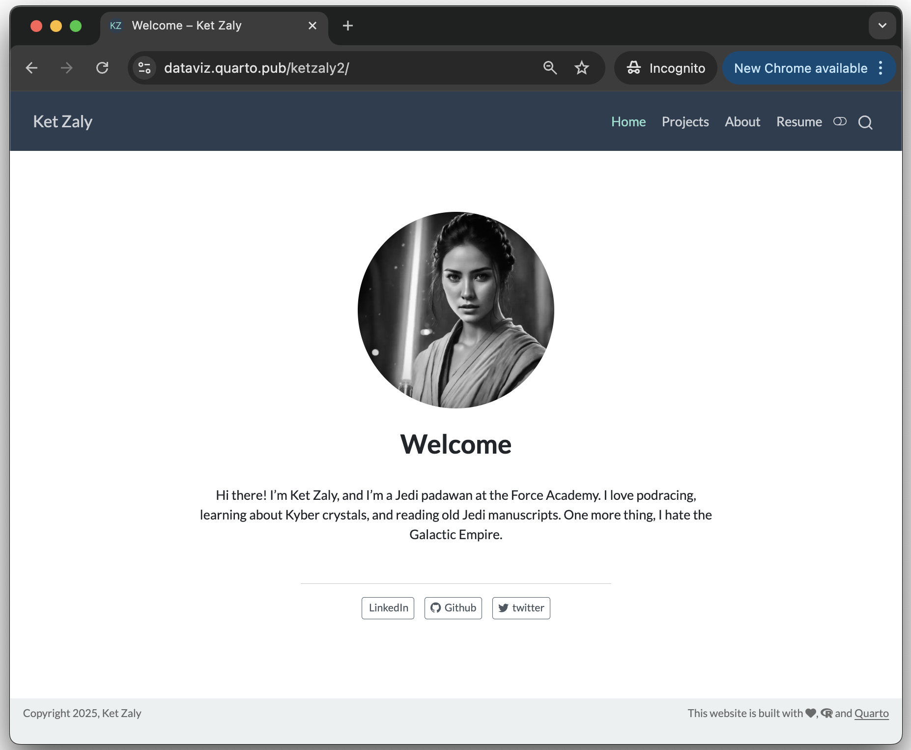

# Sample Personal Quarto Website

This repository contains a mockup Quarto website to illustrate the use of
this kind of product for creating a personal website.


## Live Demo

<a href="http://dataviz.quarto.pub/ketzaly2" target="_blank">http://dataviz.quarto.pub/ketzaly2</a>

<a href="http://dataviz.quarto.pub/ketzaly2" target="_blank"></a>


## Details: FontAwesome Icons

Notice that the `page-footer:` option in the `_quarto.yml` file uses icons from _fontawesome_. Thus, to render and/or preview this website, you need to have the quarto __fontawesome__ extension. To install this extension run the following command in RStudio's Terminal:

```bash
quarto add quarto-ext/fontawesome
```


### Use the fontawesome shortcode to embed icons

To embed an icon, look up the icon's name on FontAwesome (be sure to only choose from the <a href="https://fontawesome.com/search?ic=free">Free icons</a>), then use the fontawesome shortcode:

```

```

For example:

```



```

